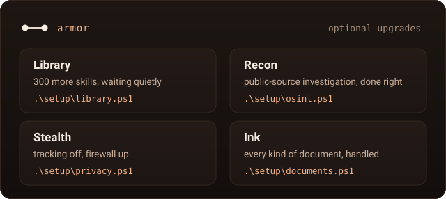

<div align="center">


# tadashi

**Hello. I am Tadashi, your personal engineering companion.**

My whole computer in one folder. Two commands, and a fresh laptop becomes mine.



</div>

## Activate

```powershell
winget install -e --id Git.Git; winget install -e --id GitHub.cli
gh auth login; gh repo clone riteshroshann/tadashi; cd tadashi
Set-ExecutionPolicy -Scope CurrentUser RemoteSigned -Force
.\setup\install.ps1; .\setup\deploy.ps1
```

New terminal after the first line. Safe to rerun, always. Tweaked something? Run `.\setup\deploy.ps1` again. The full tour lives in [the manual](Tadashi.pdf).

<br>

<div align="center">



<br>

<sub><i>I will not deactivate until you are satisfied with your setup.</i></sub>

<a href="https://github.com/riteshroshann"></a>

</div>
